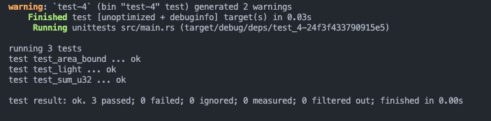

# test-4
rust traing

### 实现一个打印图形面积的函数， 它接收一个可以计算面积的类型作为参数， 比如圆形，三角形，正方形，需要用到泛型和泛型约束

- [fn computes_area](https://github.com/lc-1010/test-4/blob/main/test-4/src/main.rs#L20)
  
### 实现一个函数，为u32类型的整数集合求和，参数类型为 &[u32]，返回类型为Option，溢出时返回None
- [fn sum_u32](https://github.com/lc-1010/test-4/blob/main/test-4/src/main.rs#L66)

### 为枚举交通信号灯实现一个 trait， trait里包含一个返回时间的方法，不同的灯持续的时间不同
- [trait WaitTime](https://github.com/lc-1010/test-4/blob/main/test-4/src/main.rs#L149)
- [trait Process](https://github.com/lc-1010/test-4/blob/main/test-4/src/main.rs#L100)

## 测试运行
- 面积 [fn test_area_bound()](https://github.com/lc-1010/test-4/blob/main/test-4/src/main.rs#L131)
- 计算u32  [fn test_sum_u32()](https://github.com/lc-1010/test-4/blob/main/test-4/src/main.rs#L117)
- 红绿灯 [fn test_light() ](https://github.com/lc-1010/test-4/blob/main/test-4/src/main.rs#L167)

