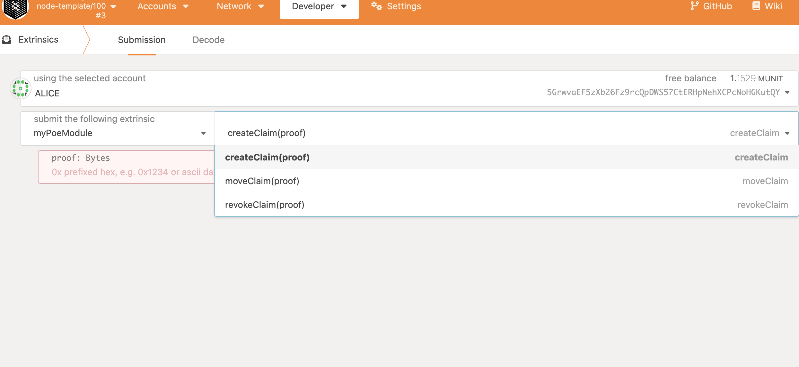
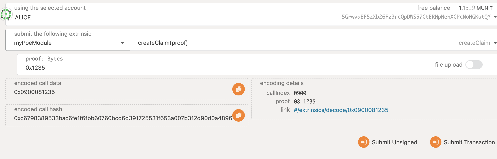
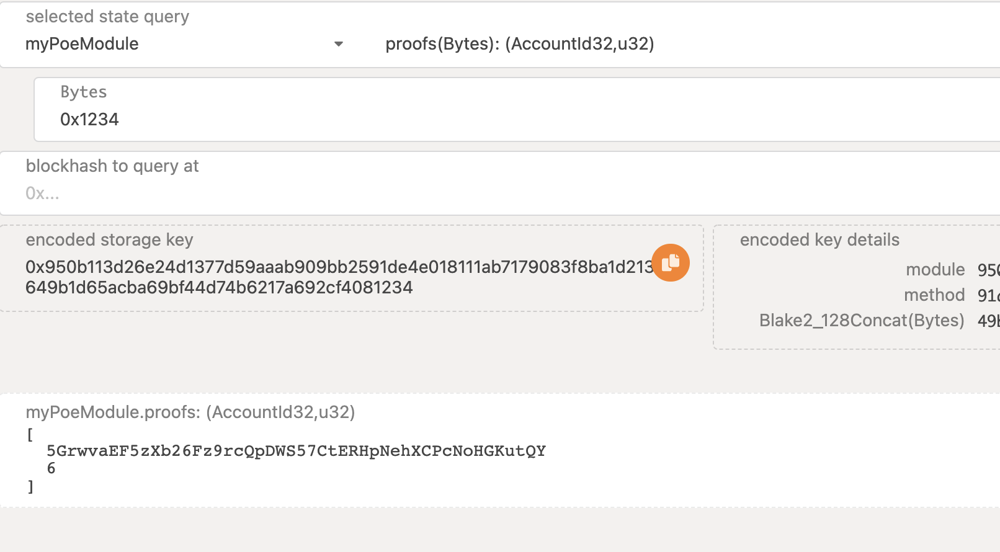
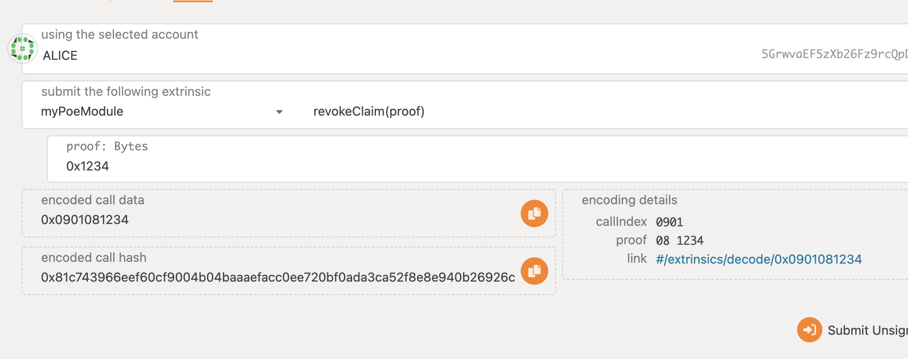
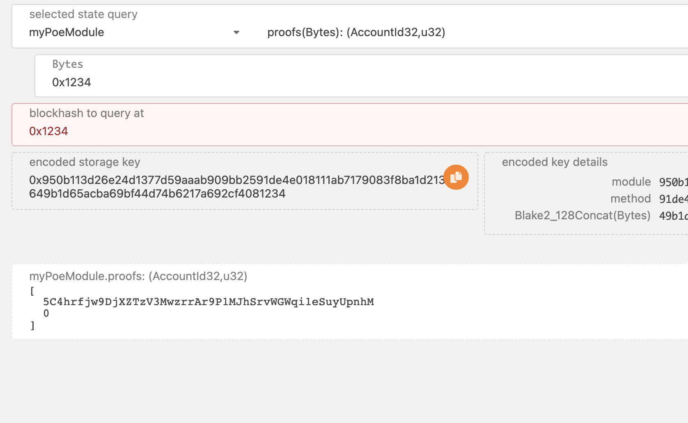
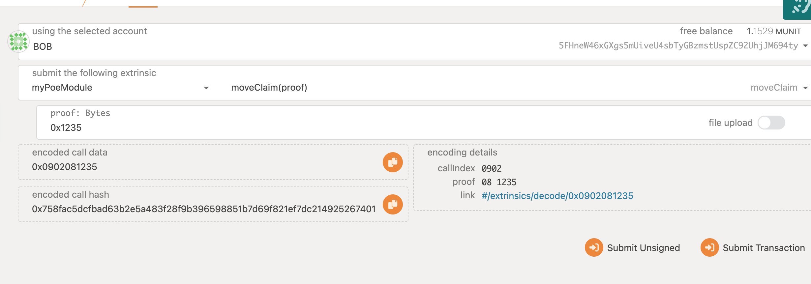
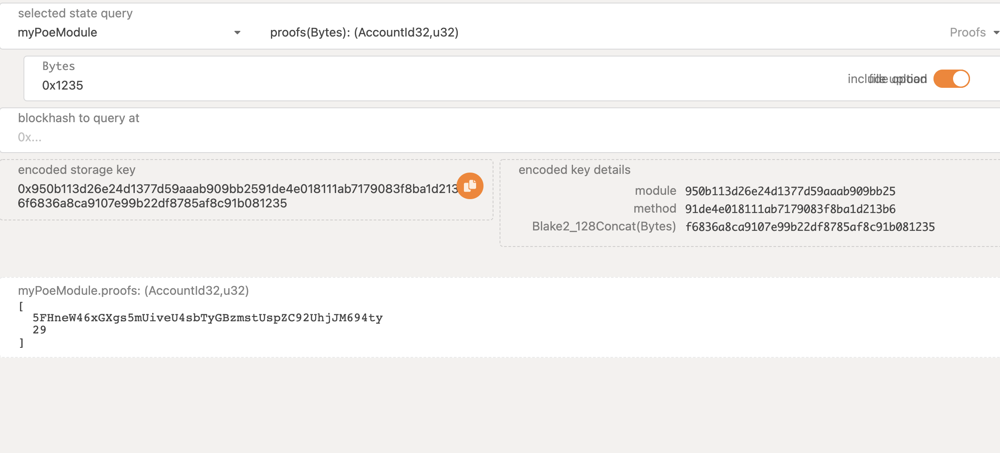

# POE

https://github.com/lc-1010/substrate-node-template/tree/my-poe 

## 存证 撤销 转移
- function 
    
     
- [create_claim-code](https://github.com/lc-1010/substrate-node-template/blob/my-poe/pallets/poe/src/lib.rs#L49)

### 创建
- create

- check

### 撤销
- [revoek_claim](https://github.com/lc-1010/substrate-node-template/blob/my-poe/pallets/poe/src/lib.rs#L62)

    
- check 
    

### 转移

- [move_claim_code](https://github.com/lc-1010/substrate-node-template/blob/my-poe/pallets/poe/src/lib.rs#L77)

    
- check
