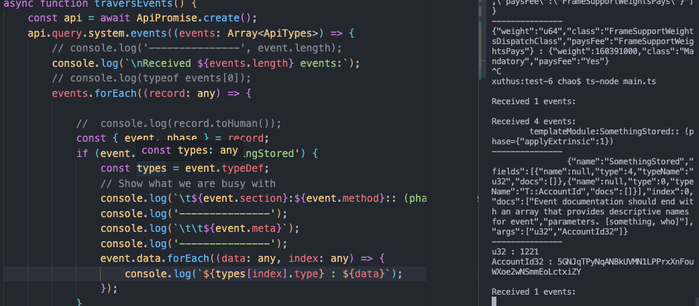

## 监控 event templateModule:SomethingStored

Additionally the metadata also provides information on events, these are query-able via the api.query.system.events() interface and also appear on transactions... both these cases are detailed later.

