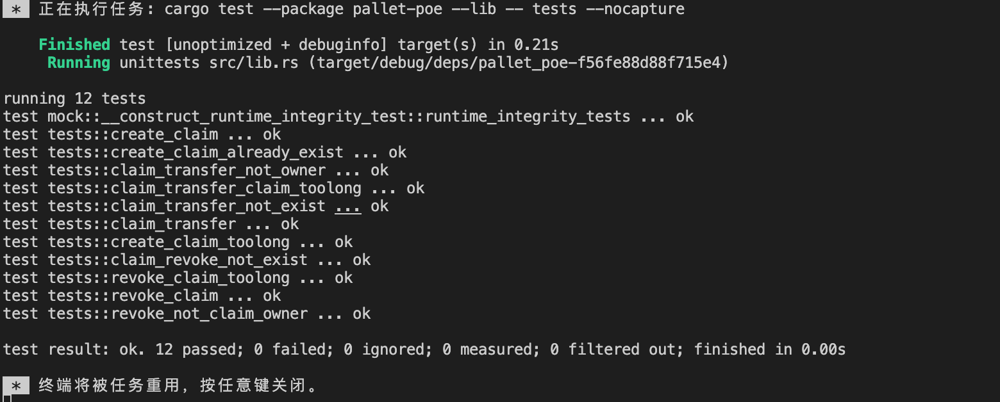

# substrate

## 1- 回顾-单元测试

- [x] 创建存证测试
- [x] 撤销存证
- [x] 转移存证

### cargo test

- 参数 -p 模块

- 脚本
```shell
 cargo test --package pallet-poe --lib -- tests --nocapture

    Finished test [unoptimized + debuginfo] target(s) in 0.21s
     Running unittests src/lib.rs (target/debug/deps/pallet_poe-f56fe88d88f715e4)

running 12 tests
test mock::__construct_runtime_integrity_test::runtime_integrity_tests ... ok
test tests::create_claim ... ok
test tests::create_claim_already_exist ... ok
test tests::claim_transfer_not_owner ... ok
test tests::claim_transfer_claim_toolong ... ok
test tests::claim_transfer_not_exist ... ok
test tests::claim_transfer ... ok
test tests::create_claim_toolong ... ok
test tests::claim_revoke_not_exist ... ok
test tests::revoke_claim_toolong ... ok
test tests::revoke_claim ... ok
test tests::revoke_not_claim_owner ... ok

test result: ok. 12 passed; 0 failed; 0 ignored; 0 measured; 0 filtered out; finished in 0.00s
```


## kittes 模块
- 增加买卖 extrinsic
- 不再pallet中指定，在runtime中绑定
- test 模块
- 引入 balances 内方法，质押token，购买时支付token
