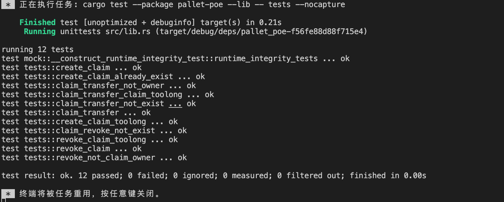
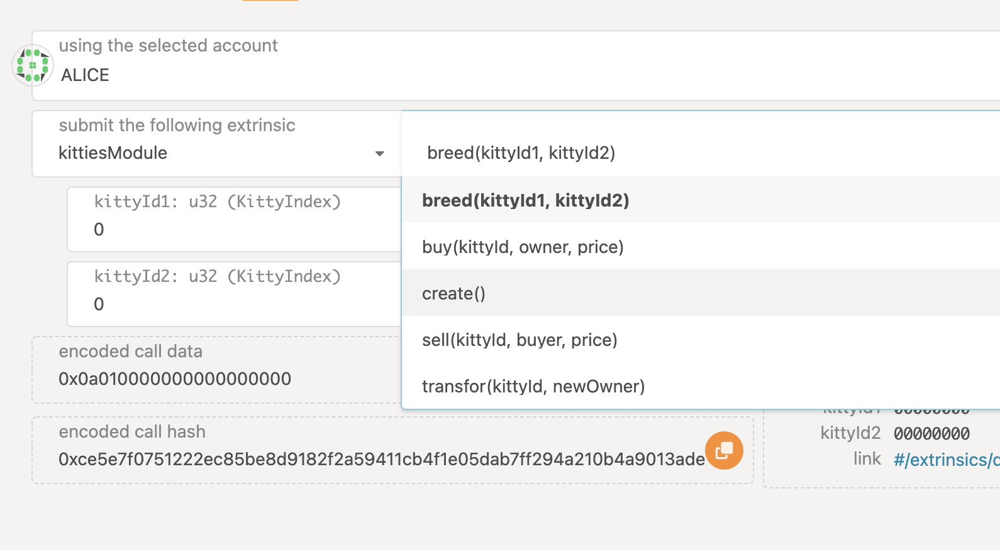
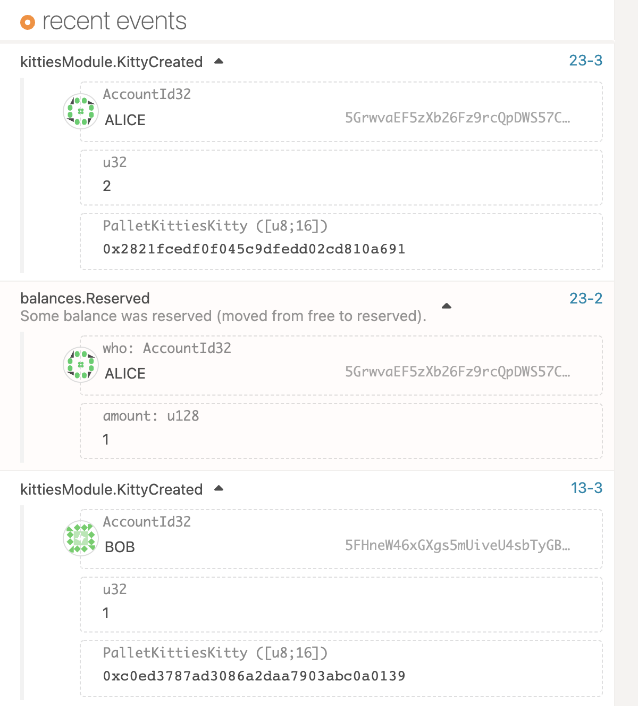
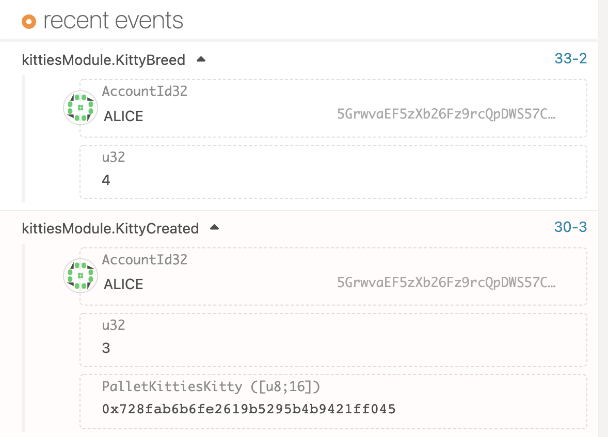
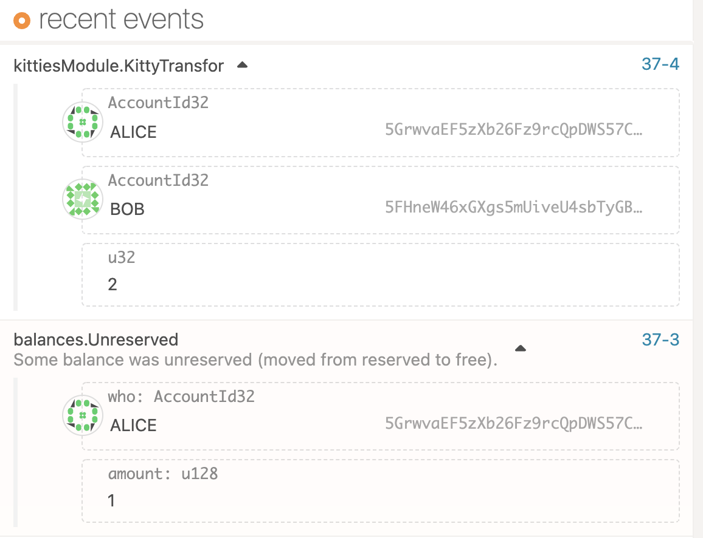
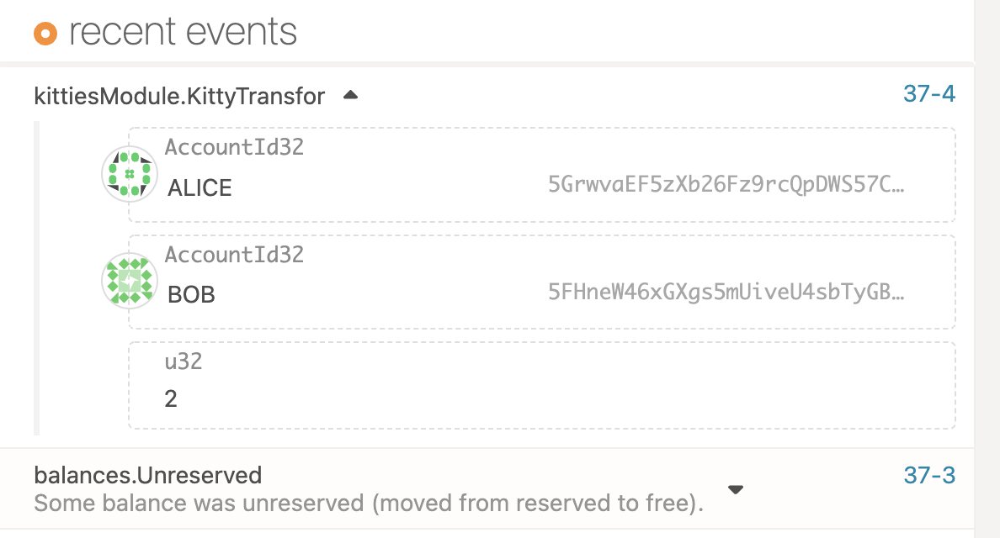
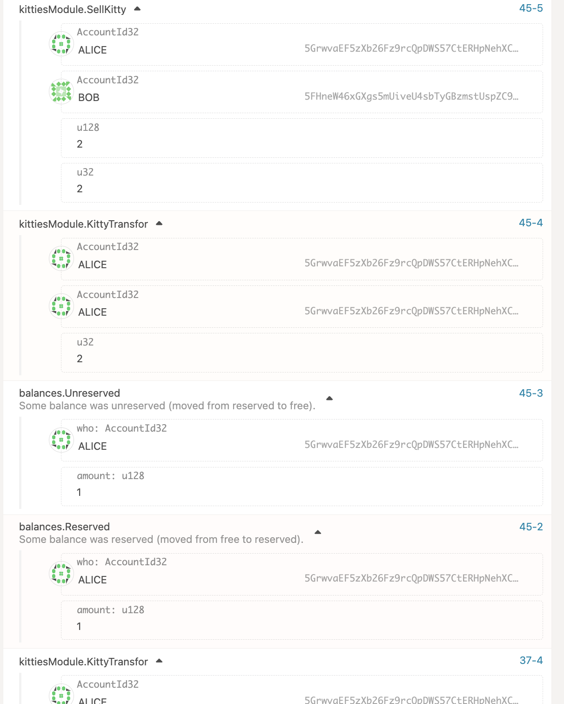
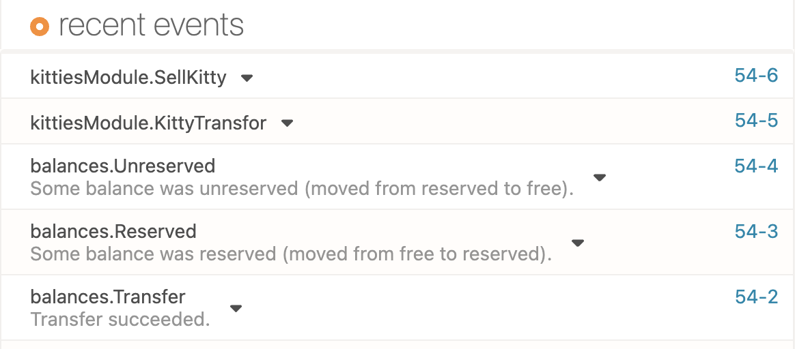
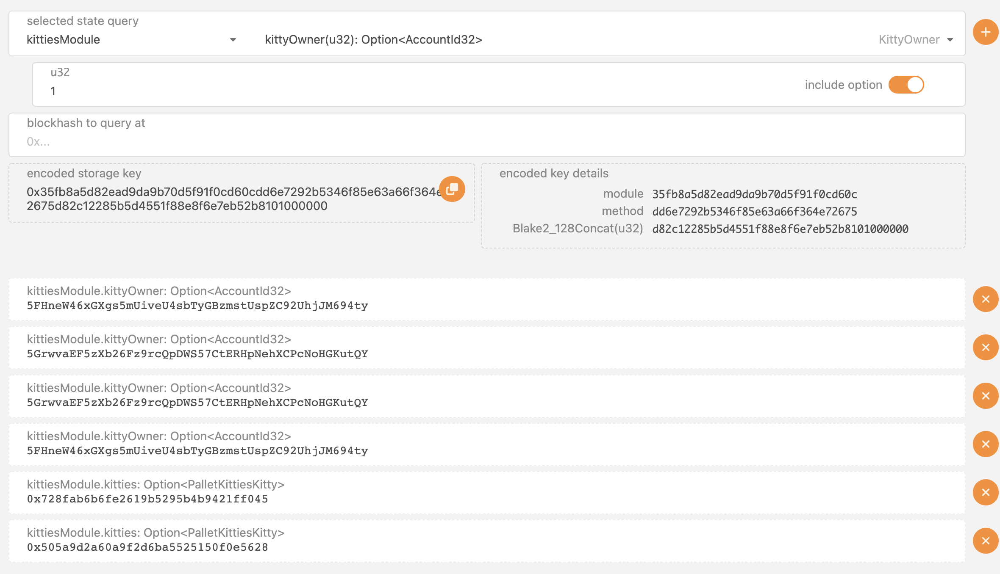

# substrate

## 1- 回顾-单元测试

- [x] 创建存证测试
- [x] 撤销存证
- [x] 转移存证

### cargo test

- 参数 -p 模块

- 脚本
```shell
 cargo test --package pallet-poe --lib -- tests --nocapture

    Finished test [unoptimized + debuginfo] target(s) in 0.21s
     Running unittests src/lib.rs (target/debug/deps/pallet_poe-f56fe88d88f715e4)

running 12 tests
test mock::__construct_runtime_integrity_test::runtime_integrity_tests ... ok
test tests::create_claim ... ok
test tests::create_claim_already_exist ... ok
test tests::claim_transfer_not_owner ... ok
test tests::claim_transfer_claim_toolong ... ok
test tests::claim_transfer_not_exist ... ok
test tests::claim_transfer ... ok
test tests::create_claim_toolong ... ok
test tests::claim_revoke_not_exist ... ok
test tests::revoke_claim_toolong ... ok
test tests::revoke_claim ... ok
test tests::revoke_not_claim_owner ... ok

test result: ok. 12 passed; 0 failed; 0 ignored; 0 measured; 0 filtered out; finished in 0.00s
```


## kittes 模块

- 增加买卖 extrinsic
- 不再pallet中指定，在runtime中绑定
- test 模块
- 引入 balances 内方法，质押token，购买时支付token

- 参考 

### 买卖

```shell
cargo build --release
   Compiling node-template-runtime v4.0.0-dev (/test-4/test-7/substrate-node-template-polkadot-v0.9.25/runtime)
   Compiling node-template v4.0.0-dev (/test-4/test-7/substrate-node-template-polkadot-v0.9.25/node)
    Finished release [optimized] target(s) in 1m 52s

 ./target/release/node-template --dev
2022-09-10 20:53:39 Substrate Node
2022-09-10 20:53:39 ✌️  version 4.0.0-dev-863e97f8f47
2022-09-10 20:53:39 ❤️  by Substrate DevHub <https://github.com/substrate-developer-hub>, 2017-2022
2022-09-10 20:53:39 📋 Chain specification: Development
2022-09-10 20:53:39 🏷  Node name: cowardly-agreement-6409
2022-09-10 20:53:39 👤 Role: AUTHORITY
2022-09-10 20:53:39 💾 Database: RocksDb at /var/folders/td/bs9n_nsj4vv2vdv16t_psxwm0000gn/T/substratedmbX8o/chains/dev/db/full
2022-09-10 20:53:39 ⛓  Native runtime: node-template-100 (node-template-1.tx1.au1)
2022-09-10 20:53:39 🔨 Initializing Genesis block/state (state: 0xc610…ac23, header-hash: 0x55be…e860)
2022-09-10 20:53:39 👴 Loading GRANDPA authority set from genesis on what appears to be first startup.
2022-09-10 20:53:39 Using default protocol ID "sup" because none is configured in the chain specs
2022-09-10 20:53:39 🏷  Local node identity is: 12D3KooWSqDdqYKgJSmT8X5zv274kdepuAW5zXteT6Pk4AcTpHLM
2022-09-10 20:53:39 💻 Operating system: macos
2022-09-10 20:53:39 💻 CPU architecture: aarch64
2022-09-10 20:53:39 📦 Highest known block at #0
2022-09-10 20:53:39 〽️ Prometheus exporter started at 127.0.0.1:9615
2022-09-10 20:53:39 Running JSON-RPC HTTP server: addr=127.0.0.1:9933, allowed origins=None
2022-09-10 20:53:39 Running JSON-RPC WS server: addr=127.0.0.1:9944, allowed origins=None
2022-09-10 20:53:42 🙌 Starting consensus session on top of parent 0x55be31b84f1476f78eb787f7b26d0c8fcdf913d3fd3d724357af4a96bddee860
2022-09-10 20:53:42 🎁 Prepared block for proposing at 1 (2 ms) [hash: 0x609ddf3764138509d4cbdf6d63b4ef0fc2a2aab5bd8752ba743f632977c150fe; parent_hash: 0x55be…e860; extrinsics (1): [0x5740…b8e9]]
```
- [全部方法](https://github.com/lc-1010/test-4/blob/main/test-7/substrate-node-template-polkadot-v0.9.25/pallets/kitties/src/lib.rs)

   
- [创建](https://github.com/lc-1010/test-4/blob/dfc3cc3e66b89dc92a46e865246bb8c1cf830c9b/test-7/substrate-node-template-polkadot-v0.9.25/pallets/kitties/src/lib.rs#L115)

   
- [繁育](https://github.com/lc-1010/test-4/blob/dfc3cc3e66b89dc92a46e865246bb8c1cf830c9b/test-7/substrate-node-template-polkadot-v0.9.25/pallets/kitties/src/lib.rs#L129)
   
- [转移](https://github.com/lc-1010/test-4/blob/dfc3cc3e66b89dc92a46e865246bb8c1cf830c9b/test-7/substrate-node-template-polkadot-v0.9.25/pallets/kitties/src/lib.rs#L162)
   
   
- [买](https://github.com/lc-1010/test-4/blob/dfc3cc3e66b89dc92a46e865246bb8c1cf830c9b/test-7/substrate-node-template-polkadot-v0.9.25/pallets/kitties/src/lib.rs#L189)
   
- [卖](https://github.com/lc-1010/test-4/blob/dfc3cc3e66b89dc92a46e865246bb8c1cf830c9b/test-7/substrate-node-template-polkadot-v0.9.25/pallets/kitties/src/lib.rs#L175)
   
   
- 查询
   

- [检测账户](https://github.com/lc-1010/test-4/blob/dfc3cc3e66b89dc92a46e865246bb8c1cf830c9b/test-7/substrate-node-template-polkadot-v0.9.25/pallets/kitties/src/lib.rs#L261)

## 测试 
-  
## 前端页面

- 