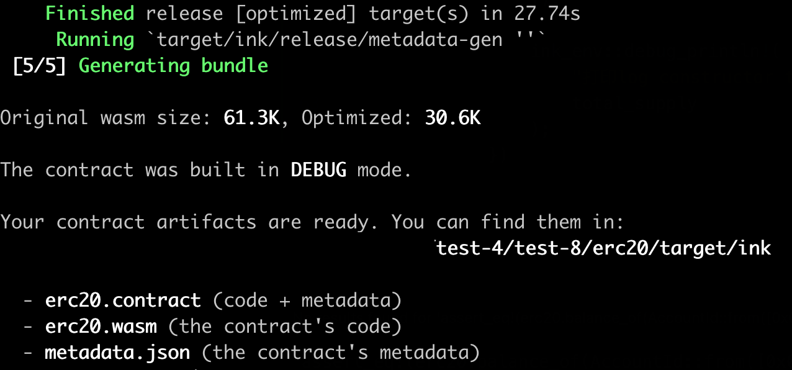

# Ink! 开发智能合约

## 安装
``` bash
  git clone https://github.com/paritytech/substrate-contracts-node.git
  git checkout v0.20.0
  ls
  cd substrate-contracts-node

  rustup component add rust-src --toolchain nightly
  rustup target add wasm32-unknown-unknown --toolchain nightly
  cargo install dylint-link
  cargo install cargo-contract --force
 cargo contract --help
```

### 存储

- #[ink(storage)]
- #[ink(constructor)]
- #[ink(message)]
- #[ink(event)]

## ERC20

- build 
  

[initialize_contract 打印log](https://github.com/lc-1010/test-4/blob/main/test-8/erc20/lib.rs#L61)

```
 ink_lang::utils::initialize_contract(|contract: &mut Self| {

  ....

ink_env::debug_println!(
                    "打印log constructor total_supply{}: initialize_contract ",
                    total_supply
                    ```
- transfer
  
  
  
  
  

- node log
  